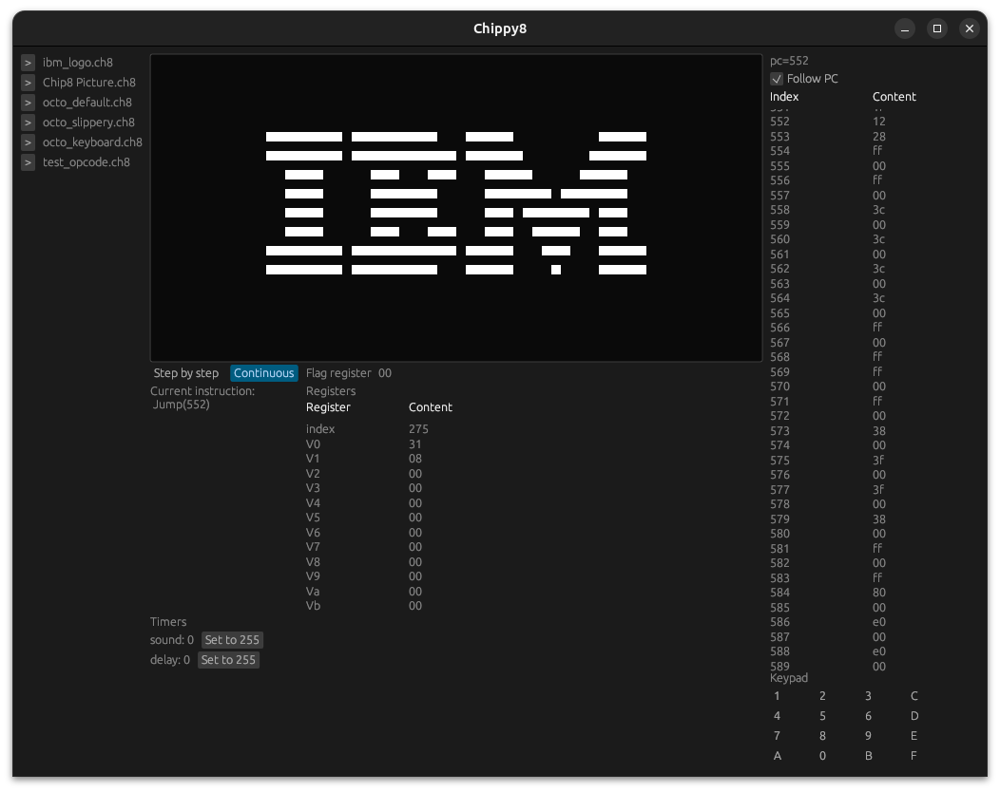
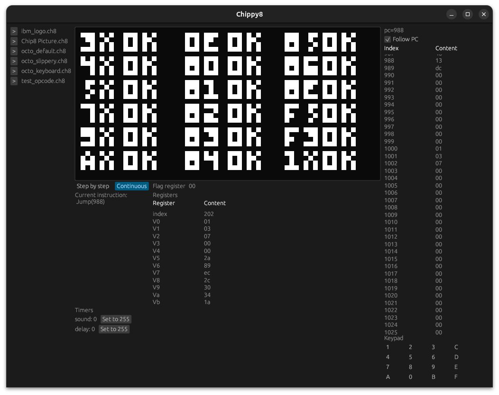

# A toy CHIP8 emulator

Mostly based on [tobiasvl's excellent guide](https://tobiasvl.github.io/blog/write-a-chip-8-emulator/)

## Screenshots

### Status

Working on simple test ROMs. Remaining issues around:
- Timing / instructions per second (currently egui events drive the emulator, which isn't great)
- Font rendering (e.g. octo_keyboard)
- Keyboard handling (e.g. octo_keyboard, octo_default)

## References

- [Octo IDE](http://johnearnest.github.io/Octo)
- [Guide to making a CHIP-8 emulator](https://tobiasvl.github.io/blog/write-a-chip-8-emulator/)